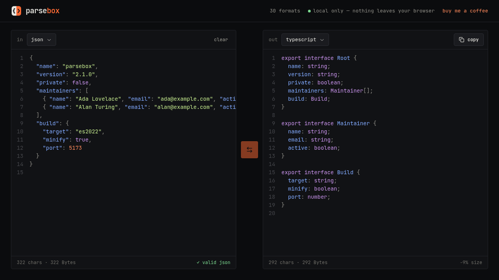

# ParseBox

**Convert JSON, YAML, XML, CSV, TOML and 20+ other formats in your browser.**
Decode JWT, Base64 and URL encoding, and generate TypeScript, Zod, Go, Rust, Python and other types from a sample.

**→ [parsebox.app](https://parsebox.app)**



## Private by design

ParseBox runs entirely in your browser.
Your text is never uploaded, logged or stored on a server, so it is safe to paste API responses, tokens and `.env` files.

## Features

- **Auto detect:** paste anything, and ParseBox finds the format.
- **Decode chain:** peels Base64, URL encoding, gzip and JWT layers until it reaches the data inside.
- **JSON repair:** fixes trailing commas, single quotes and missing quotes, and shows the line of any error that remains.
- **Loss report:** tells you what the target format cannot keep, such as comments, dates, or nested objects in a CSV cell.
- **Secret detection:** finds API keys and passwords, and can mask them in the output.
- **Type generation:** TypeScript, Zod, JSON Schema, Go, Protobuf, Rust (serde), Python (Pydantic), C#, Kotlin, Swift and Java.
- **Large files:** conversion runs in a Web Worker, so the page stays responsive.

## Formats

| Group | Formats |
| --- | --- |
| Data | Plain text, JSON, JSON5, XML, YAML, TOML, TOON, INI, dotenv, CSV, TSV, JSONL, query string |
| Encodings | MessagePack, Base64, hexadecimal, binary, URI encoding, JWT (input only) |
| Types & schemas (output only) | TypeScript, Zod, JSON Schema, Go, Protobuf, Rust, Python, C#, Kotlin, Swift, Java |

Popular conversions have their own pages, for example
[JSON to YAML](https://parsebox.app/json-to-yaml),
[CSV to JSON](https://parsebox.app/csv-to-json),
[JSON to TypeScript](https://parsebox.app/json-to-typescript) and
[JWT decoder](https://parsebox.app/jwt-decoder).

## Development

```sh
pnpm install
pnpm dev        # dev server at http://localhost:5173
pnpm test       # node --test; needs Node 22.6 or later
pnpm build      # type-check, build, and write the landing pages to dist/
```

- The landing pages are listed in `src/seo/pages.ts`.
- At build time, `src/seo/vite-plugin.ts` writes one static HTML file per page, plus `sitemap.xml`, `llms.txt` and `404.html`.

## License

[MIT](LICENSE)
